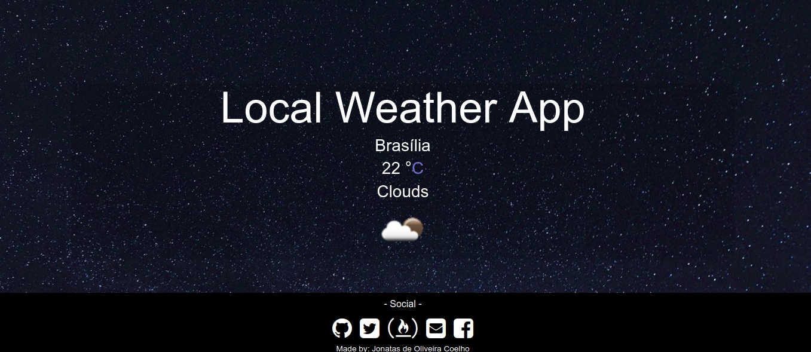

# FreeCodeCamp Challenge - LocalWeather
---

💻 Challenge of [FreeCodeCamp](https://www.freecodecamp.org).

Link: [LocalWether](https://jonatasoc.github.io/fcc-04-LocalWeather/)

# :cloud: LocalWeather

   

---

# :rocket: Features

* #### Connect to an API to get the local Weather.
* #### Work with navigator.geolocation API

# :postbox: Faq

**Question:** What are the tecnologies used in this project?

**Answer:** The challenges was to use just HTML, CSS and Javascript.

